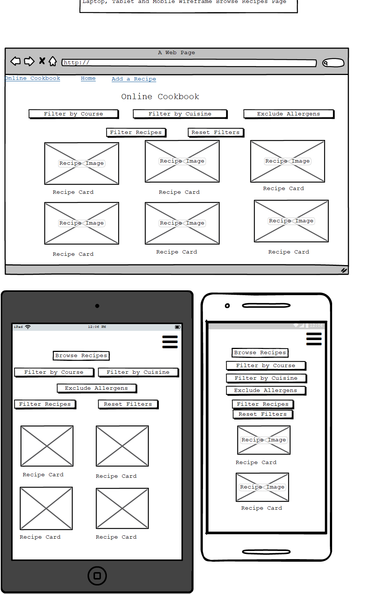
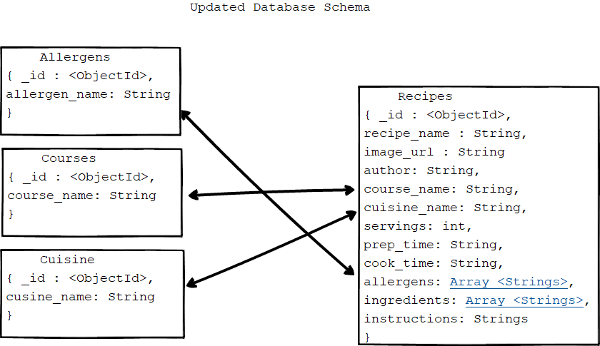

# Online Cookbook App Milestone 3
This project was created as an End of Module Project for the Code Institute's Data Centric Development Module. I chose to follow the example brief and create and an online cookbook. I decided to focus on dinner options from around the world. A user can select a starter, main course or desert from a variety of cuisines.

## UX
When a user first opens my appication they are able to view and scroll through a number of different recipes.These recipes are organised by cuisine type and within that by course name. There is a navbar at the top of the page that takes the user back to the Home Page (if not already there) and also allows them 'Add a Recipe'. There are three drop down menus just under the header that allow users to filter the recipes based on cuisine type and/or potential allergens. A recipe can be viewed in its entirety by clicking on its recipe card. The user is then taken to a single page that displays the recipe, this its name, chef of recipe author, preparation and cook time, cuisine type, course name, recipe image, igredients and preparation and cooking instructions. At the bottom of the page there are two buttons that allow a user to delete or edit the recipe. Choosing to Add or a Recipe takes a user to a single page containing a form that allows them to add or update a recipe and submit it to the database. Upon submission the user will be taken back to the Homepage where the updated / new recipe can be viewed. 

#### User Stories
* As a user I want to visit this site so that I can search for recipes that do not contain ingredients I am allergic to.
* As a user I want to visit this site to give me some ideas for a dinner party I am throwing.
* As foodie I want to visit this site so that I can filter recipes based on different types of cuisine. 
* As a keen baker I want to visit this site so that I can search for and edit various recipes.

#### Wireframes
* Browse Recipes 
* Add Recipe 
* Display Recipe 
* Edit Recipe 

#### Database Schema
* Updated Schema 

##### Example from Recipes Collection
    {
        _id:ObjectId("5c8ec1751c9d4400002eae5f")
        recipe_name: "Aubergine and mozzarella bake"
        image_url: "https://ichef.bbci.co.uk/food/ic/food_16x9_832/recipes/aubergine_and_mozzarella_51464_16x9.jpg"
        author: "Antonio Carluccio"
        course_name: "Main"
        cuisine_name: "Italian"
        servings: 4
        prep_time: "less than 30mins"
        cook_time: "30 mins to 1 hour"
        allergens: Array
                    0 :"dairy"
        ingredients: Array
                        0: 3 tbsp olive oil
                        1: 3 garlic cloves, crushed
                        2: 2 x 400g tin chopped tomatoes
                        3: salt and pepper
                        4: 2 medium to large aubergines
                        5: 1 ball mozzarella, drained and torn into pieces
                        
        instructions:   Preheat the oven to 200C/400F/Gas 6. Heat a saucepan over a medium heat. Add one tablespoon of                  the olive oil and, once hot, add the onion and a pinch of salt. Fry the onion for 4-5 minutes,                  or until softened. Add the garlic and continue to cook for two minutes. Pour in the tomatoes and                 mix well, breaking up any larger bits with the back of your spoon. Season with a pinch of salt                  and pepper and bring to a simmer. Reduce the heat and simmer gently for 20-30 minutes, or until                 the tomato sauce is thickened and flavoursome. Meanwhile slice the aubergines lengthways into                   slices 5mm/¼in thick. Brush the aubergine slices with olive oil and season well with salt and                   pepper on both sides. Heat a griddle pan until smoking hot and then griddle in batches for 2-3                  minutes on each side, or until all the slices are golden brown. Alternatively, heat the grill to                 high, place half of the aubergine slices on a baking tray and grill for 3-4 minutes on each                     side. Continue with the rest of the slices until they are all golden-brown. Remove and leave to                 one side once cooked. Add a spoonful of tomato sauce to the bottom of a medium sized ovenproof                  baking dish (about 28x22cm/11x8½in)and spread evenly. Top with a third of the aubergine slices.                 Follow with a third of the remaining tomato sauce and top with a third of the mozzarella. Repeat                 the process for another two layers finishing with tomato sauce and the mozzarella. Place into                   the preheated oven and bake for 25-30 minutes, or until the dish is bubbling and the mozzarella                 melted and golden-brown on top.
    }
    
##### Cuisine Collection
    {  
        _id: ObjectId("5c8d0f7f1c9d4400004b5187")  
        cuisine_name:"American"  
    }

##### Course Collection
    {     
        _id: ObjectId("5c9001751c9d4400007fae6c")  
        course:"Main"  
    }

## Features

#### Existing Features
#### Features Left to Implement

## Technologies Used
* HTML5 for injecting content into the templates
* Bootstrap4 and CSS3 for structuring and styling the templates
* JavaScript / jQuery added interactivity to the site. 
* Flask was used to run the application and code was written in the Python 
* MongoDB Atlas was used for creating and storing the database
* Jinja was used for rendering the templates

## Deployment
This application was developed entirely in Cloud9 and was deployed using Heroku. A live version of the site can be found [here](https://online-cookbook4.herokuapp.com/). Version control was done using git. 
To deploy the application to Heroku, I connected my Heroku app to the relevant GitHub repository to allow for automatic deploys from the GitHub master branch. I stored the MONGO_URI string and DATABASE_NAME as environment variables that are accessed using the os.getenv() method and I set debug mode to False. 

## Testing
My CSS file was tested using the Jigsaw validator and no errors were found. 

    

This app ws developed on the Firefox browser and each new piece of functionality was tested as it was being developed. After creating the 'Add Recipe' and 'Edit Recipe' forms I filled in each form and submitted recipes to the database through the frontend. 
I also posted a link to my site in the Slack forums and asked my coursemates to test it. It was brought to my attention that there was an issue when submitting the 'Edit Recipe' form. This was quickly sorted out when I discovered that I had renamed some variables in my app.py file and hadn't updated the HTML to reflect that. 
I also made sure all the buttons worked and that there were no broken links. 
The application was examined on a number of screen sizes using the brower's dev tools. It looks well on:
* 720p HD Television
* Galaxy Note9
* Galaxy S9
* iPad
* iPad Mini
* iPad 10.5 inch
* iPhone X/XS
* Kindle Fire HDX
* Laptop with HIiDPI
* Laptop with MDPI
* Laptop with touch
* Nexus 10

## Credits

#### Content
The code for creating the button to allow users to go back to the previous page, I got from [w3schools](https://www.w3schools.com/jsref/met_his_go.asp)

The code for adding and removing input elements, which allows a user to add or remove ingredients, I got from [stackoverflow](https://stackoverflow.com/questions/9173182/add-remove-input-field-dynamically-with-jquery)

The colour scheme I used for my buttons, font-colours, headings and footers was gotten from [here](https://learnui.design/tools/data-color-picker.html#palette)

The jQuery code to cause an alert message when the user submits or edits a recipe I got from [w3schools](https://www.w3schools.com/jquERY/event_submit.asp)

All of the recipes on my database and add by me, through the front end were obtained from                            [bbc food](https://www.bbc.com/food)

The code for sorting the recipes on my Home Page I got from [stackoverflow](https://stackoverflow.com/questions/43472561/mongodb-sort-the-result-after-limit)

All recipes that I added, either directly into MongoDB or through the front end when testing, were obtained from [bbc food](https://www.bbc.com/food) and are used for educational purposes only. 

The code to disable the Filter Recipes button unless at least one check box has been selected was found [here](https://www.askingbox.com/tutorial/jquery-disable-submit-button-if-no-checkbox-is-selected)

Thank you to my fellow coursemate Tim Nelson for providng the following code:
$('#ingredients-row input:last').remove();
that helped solve an issue whereby the 'remove-input-btn' was removing the first element of the ingredient list instead of the last. 

#### Media
The image in my header I got from [pixabay](https://pixabay.com/photos/ingredients-cooking-preparation-498199/)

#### Acknowledgements

